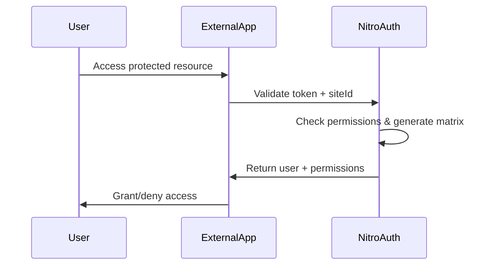

# External Site Integration Guide

## Overview

NitroAuth provides comprehensive authentication and fine-grained authorization for external applications. This guide covers integration patterns, edge cases, and best practices.

## 🔐 Authentication Flow

### 1. User Authentication


### 2. Validation API Endpoint

**POST** `/api/validate`

```json
{
  "auth_token": "jwt_token_from_url_params",
  "user_id": "user_clerk_id",
  "siteId": "your_app_identifier",
  "requestedPermissions": ["dashboard:read", "users:write"]
}
```

**Response:**
```json
{
  "valid": true,
  "user": {
    "id": "user_123",
    "email": "user@example.com",
    "role": "admin",
    "firstName": "John",
    "lastName": "Doe"
  },
  "permissions": {
    "dashboard:read": true,
    "dashboard:write": true,
    "users:read": true,
    "users:write": true,
    "users:delete": false,
    "reports:admin": false
  },
  "requestedPermissions": {
    "dashboard:read": true,
    "users:write": true
  },
  "sessionInfo": {
    "expiresAt": "2024-01-01T20:00:00Z",
    "renewAt": "2024-01-01T14:55:00Z",
    "sessionId": "user_123_myapp_1234567890"
  }
}
```

## 🎯 Fine-Grained Permissions

### Permission Format
Permissions follow the format: `resource:action[:scope]`

- **Resource**: dashboard, users, reports, settings, analytics, billing
- **Action**: read, write, delete, admin
- **Scope**: own, team, department, all (optional)

### Examples
```javascript
// Check if user can read dashboard
if (permissions['dashboard:read']) {
  showDashboard()
}

// Check if user can delete users
if (permissions['users:delete']) {
  showDeleteButton()
}

// Check if user has admin access to reports
if (permissions['reports:admin']) {
  showReportManagement()
}
```

## 🚨 Critical Edge Cases & Solutions

### 1. Token Expiration
**Problem**: JWT tokens expire after 1 hour
```javascript
// ❌ Bad: Don't handle expiration
const validation = await validateUser(token)

// ✅ Good: Handle expiration gracefully
const validation = await validateUser(token)
if (!validation.valid && validation.error === 'Token expired') {
  // Redirect to NitroAuth for re-authentication
  window.location.href = `https://nitroauth.com/?redirect=${encodeURIComponent(window.location.href)}`
}
```

### 2. Permission Changes During Session
**Problem**: User permissions change while actively using your app
```javascript
// ✅ Solution: Re-validate on sensitive actions
async function deleteUser(userId) {
  const validation = await validateUser(currentToken)
  if (!validation.permissions['users:delete']) {
    alert('Permission denied: Your access has been revoked')
    return
  }
  // Proceed with deletion
}
```

### 3. Network Failures
**Problem**: NitroAuth service unavailable
```javascript
// ✅ Solution: Graceful degradation
async function validateUser(token) {
  try {
    return await fetch('/api/validate', { ... })
  } catch (error) {
    // Cache last known permissions for short period
    const cached = getCachedPermissions()
    if (cached && cached.timestamp > Date.now() - 300000) { // 5 minutes
      console.warn('Using cached permissions due to network error')
      return cached
    }
    
    // Fail secure - deny access
    return { valid: false, error: 'Service unavailable' }
  }
}
```

### 4. IP Address Changes
**Problem**: User IP changes (mobile users, VPN switches)
```javascript
// ✅ Solution: Handle IP changes gracefully
const validation = await validateUser(token, {
  allowIPChange: true,
  maxIPChanges: 3 // per session
})
```

### 5. Time Zone Restrictions
**Problem**: Time-based access across different time zones
```javascript
// ✅ Solution: Send user timezone
const validation = await validateUser(token, {
  siteId: 'myapp',
  timezone: Intl.DateTimeFormat().resolvedOptions().timeZone
})
```

## 📝 Integration Code Examples

### React/JavaScript Integration
```javascript
import { useState, useEffect } from 'react'

export function useNitroAuth(siteId) {
  const [user, setUser] = useState(null)
  const [permissions, setPermissions] = useState({})
  const [loading, setLoading] = useState(true)

  useEffect(() => {
    validateCurrentUser()
  }, [])

  async function validateCurrentUser() {
    const urlParams = new URLSearchParams(window.location.search)
    const authToken = urlParams.get('auth_token')
    const userId = urlParams.get('user_id')

    if (!authToken || !userId) {
      redirectToAuth()
      return
    }

    try {
      const response = await fetch('/api/validate', {
        method: 'POST',
        headers: { 'Content-Type': 'application/json' },
        body: JSON.stringify({
          auth_token: authToken,
          user_id: userId,
          siteId: siteId
        })
      })

      const result = await response.json()
      
      if (result.valid) {
        setUser(result.user)
        setPermissions(result.permissions)
        
        // Clean URL
        window.history.replaceState({}, document.title, window.location.pathname)
      } else {
        redirectToAuth()
      }
    } catch (error) {
      console.error('Validation failed:', error)
      redirectToAuth()
    } finally {
      setLoading(false)
    }
  }

  function redirectToAuth() {
    const redirectUrl = encodeURIComponent(window.location.href)
    window.location.href = `https://nitroauth.com/?redirect=${redirectUrl}&site=${siteId}`
  }

  function hasPermission(resource, action, scope = null) {
    const key = scope ? `${resource}:${action}:${scope}` : `${resource}:${action}`
    return permissions[key] === true
  }

  return { user, permissions, loading, hasPermission }
}

// Usage in component
function Dashboard() {
  const { user, hasPermission, loading } = useNitroAuth('myapp')
  
  if (loading) return <div>Loading...</div>
  
  return (
    <div>
      <h1>Welcome, {user.firstName}!</h1>
      
      {hasPermission('dashboard', 'read') && (
        <DashboardContent />
      )}
      
      {hasPermission('users', 'write') && (
        <UserManagement />
      )}
      
      {hasPermission('reports', 'admin') && (
        <AdminReports />
      )}
    </div>
  )
}
```

### Python/Django Integration
```python
# views.py
import requests
from django.shortcuts import redirect
from django.contrib.auth.decorators import login_required
from django.http import JsonResponse

class NitroAuthMixin:
    def validate_nitro_auth(self, request, site_id):
        auth_token = request.GET.get('auth_token')
        user_id = request.GET.get('user_id')
        
        if not auth_token or not user_id:
            return self.redirect_to_auth(request, site_id)
        
        try:
            response = requests.post('https://your-nitroauth.com/api/validate', json={
                'auth_token': auth_token,
                'user_id': user_id,
                'siteId': site_id
            })
            
            result = response.json()
            if result['valid']:
                # Store in session
                request.session['nitro_user'] = result['user']
                request.session['nitro_permissions'] = result['permissions']
                return result
            else:
                return self.redirect_to_auth(request, site_id)
                
        except Exception as e:
            print(f"NitroAuth validation error: {e}")
            return self.redirect_to_auth(request, site_id)
    
    def redirect_to_auth(self, request, site_id):
        redirect_url = request.build_absolute_uri()
        auth_url = f"https://nitroauth.com/?redirect={redirect_url}&site={site_id}"
        return redirect(auth_url)
    
    def has_permission(self, request, resource, action, scope=None):
        permissions = request.session.get('nitro_permissions', {})
        key = f"{resource}:{action}:{scope}" if scope else f"{resource}:{action}"
        return permissions.get(key, False)

class DashboardView(NitroAuthMixin, View):
    def get(self, request):
        # Validate authentication
        auth_result = self.validate_nitro_auth(request, 'myapp')
        if isinstance(auth_result, HttpResponseRedirect):
            return auth_result
        
        # Check permissions
        if not self.has_permission(request, 'dashboard', 'read'):
            return JsonResponse({'error': 'Access denied'}, status=403)
        
        return render(request, 'dashboard.html', {
            'user': request.session['nitro_user'],
            'can_manage_users': self.has_permission(request, 'users', 'write')
        })
```

### PHP Integration
```php
<?php
class NitroAuth {
    private $siteId;
    private $baseUrl;
    
    public function __construct($siteId, $baseUrl = 'https://your-nitroauth.com') {
        $this->siteId = $siteId;
        $this->baseUrl = $baseUrl;
    }
    
    public function validateUser() {
        $authToken = $_GET['auth_token'] ?? null;
        $userId = $_GET['user_id'] ?? null;
        
        if (!$authToken || !$userId) {
            $this->redirectToAuth();
            return false;
        }
        
        $data = [
            'auth_token' => $authToken,
            'user_id' => $userId,
            'siteId' => $this->siteId
        ];
        
        $context = stream_context_create([
            'http' => [
                'method' => 'POST',
                'header' => 'Content-Type: application/json',
                'content' => json_encode($data)
            ]
        ]);
        
        try {
            $response = file_get_contents($this->baseUrl . '/api/validate', false, $context);
            $result = json_decode($response, true);
            
            if ($result['valid']) {
                $_SESSION['nitro_user'] = $result['user'];
                $_SESSION['nitro_permissions'] = $result['permissions'];
                return $result;
            }
        } catch (Exception $e) {
            error_log("NitroAuth validation error: " . $e->getMessage());
        }
        
        $this->redirectToAuth();
        return false;
    }
    
    public function hasPermission($resource, $action, $scope = null) {
        $permissions = $_SESSION['nitro_permissions'] ?? [];
        $key = $scope ? "{$resource}:{$action}:{$scope}" : "{$resource}:{$action}";
        return isset($permissions[$key]) && $permissions[$key] === true;
    }
    
    private function redirectToAuth() {
        $currentUrl = "http://$_SERVER[HTTP_HOST]$_SERVER[REQUEST_URI]";
        $redirectUrl = urlencode($currentUrl);
        header("Location: https://nitroauth.com/?redirect={$redirectUrl}&site={$this->siteId}");
        exit;
    }
}

// Usage
session_start();
$nitroAuth = new NitroAuth('myapp');

if (!$nitroAuth->validateUser()) {
    exit; // Will redirect to auth
}

$user = $_SESSION['nitro_user'];
?>

<h1>Welcome, <?= htmlspecialchars($user['firstName']) ?>!</h1>

<?php if ($nitroAuth->hasPermission('dashboard', 'read')): ?>
    <div id="dashboard">Dashboard content here</div>
<?php endif; ?>

<?php if ($nitroAuth->hasPermission('users', 'write')): ?>
    <div id="user-management">User management tools</div>
<?php endif; ?>
```

## 🔧 Advanced Configuration

### Time-Based Access
```javascript
// External site checks time restrictions
const validation = await validateUser(token, {
  siteId: 'myapp',
  checkTimeRestrictions: true,
  userTimezone: 'America/New_York'
})

if (!validation.valid && validation.error === 'Access not allowed at this time') {
  showMessage('Access is restricted outside business hours')
}
```

### IP Whitelisting
```javascript
// External site enforces IP restrictions
const validation = await validateUser(token, {
  siteId: 'myapp',
  enforceIPRestrictions: true,
  currentIP: getUserIP()
})
```

### Custom Permission Scopes
```javascript
// Check permissions with custom scopes
const permissions = {
  'documents:read:own': true,     // Can read own documents
  'documents:read:team': false,   // Cannot read team documents
  'documents:write:own': true,    // Can edit own documents
  'documents:admin:all': false    // Cannot admin all documents
}

// Check if user can edit a specific document
function canEditDocument(document, userId, permissions) {
  if (permissions['documents:admin:all']) return true
  if (permissions['documents:write:team'] && document.teamId === user.teamId) return true
  if (permissions['documents:write:own'] && document.ownerId === userId) return true
  return false
}
```

## 🚀 Production Checklist

### Security
- [ ] Implement HTTPS for all API calls
- [ ] Validate all JWT tokens on server-side
- [ ] Implement rate limiting for validation endpoint
- [ ] Log all authentication attempts
- [ ] Use secure session storage
- [ ] Implement CSRF protection

### Performance
- [ ] Cache user permissions for short periods (5-10 minutes)
- [ ] Implement connection pooling for API calls
- [ ] Add request timeouts (5-10 seconds)
- [ ] Monitor API response times
- [ ] Implement graceful degradation

### Monitoring
- [ ] Track authentication success/failure rates
- [ ] Monitor API latency and errors
- [ ] Set up alerts for service disruptions
- [ ] Log security events and anomalies
- [ ] Track permission usage patterns

### Error Handling
- [ ] Implement comprehensive error handling
- [ ] Provide user-friendly error messages
- [ ] Log errors for debugging
- [ ] Implement retry mechanisms
- [ ] Plan for service outages

This comprehensive integration ensures your external applications can seamlessly authenticate users through NitroAuth while handling all the critical edge cases that arise in production environments.